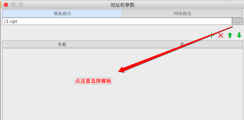

# 表单网页框控件

该插件支持在FineReport V8.0的表单中使用网页框控件

## API接口

1. setValue:(String)v
设置并刷新网页框控件的地址(保留原参数)
2. getValue
获取网页框控件的src地址
3. reset
重置网页框控件并刷新
   

## 效果图

1. 选择控件界面

2. 设置控件的地址和参数入口

3. 设置控件的模板地址界面

4. 设置控件的网络地址界面

5. 预览效果
