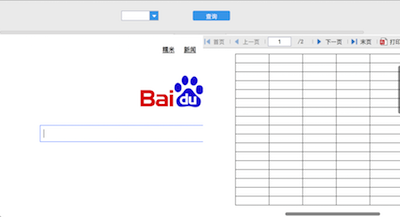

# 表单网页框控件
## 插件编译
将帆软报表安装目录下的相关jar包:

$installDir/fr-designer-core-8.0.jar

$installDir/fr-designer-chart-8.0.jar

$installDir/fr-designer-report-8.0.jar

$installDir/WebReport/WEB-INF/lib/fr-core-8.0.jar

$installDir/WebReport/WEB-INF/lib/fr-chart-8.0.jar

$installDir/WebReport/WEB-INF/lib/fr-report-8.0.jar

$installDir/WebReport/WEB-INF/lib/fr-platform-8.0.jar

$installDir/WebReport/WEB-INF/lib/fr-third-8.0.jar

拷贝到项目工程的lib/report目录下（如果没有该目录则自行新建）

然后执行ant命名来编辑插件包：
`ant -f build.xml jar`

## 插件安装
使用帆软设计器自带的插件管理器即可安装。
## 插件使用
选择控件界面，从这个界面中选择网页框并拖动到表单中：


设置控件的地址和参数入口：


设置控件的模板地址界面：


设置控件的网络地址界面：


预览效果：



## 支持的API
```setValue:(String)v``` 设置并刷新网页框控件的地址(保留原参数)

```getValue()``` 获取网页框控件的src地址

```reset()``` 重置网页框控件并刷新

